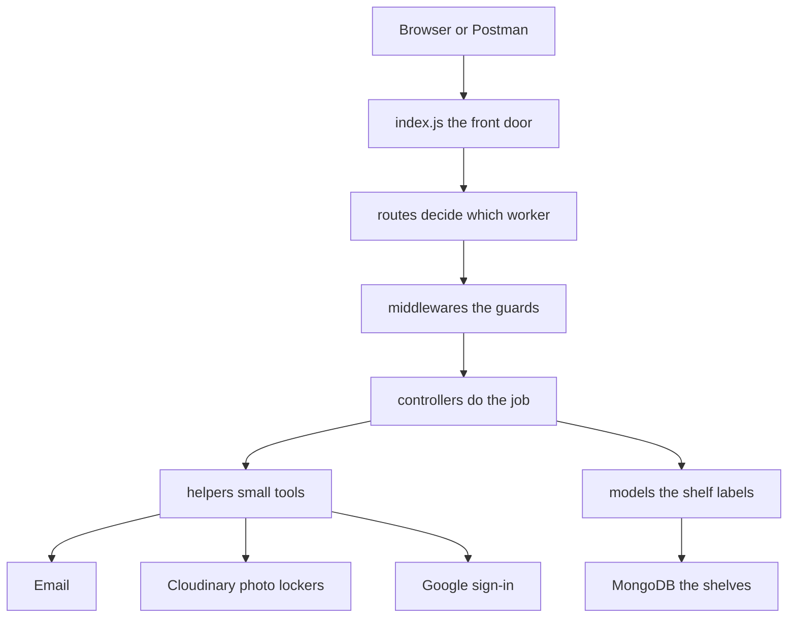
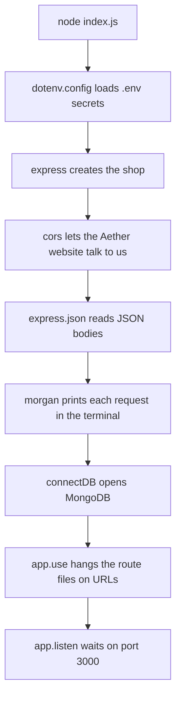
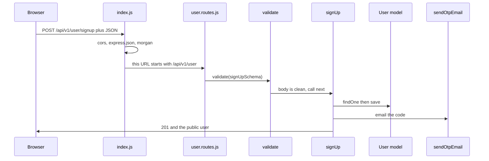
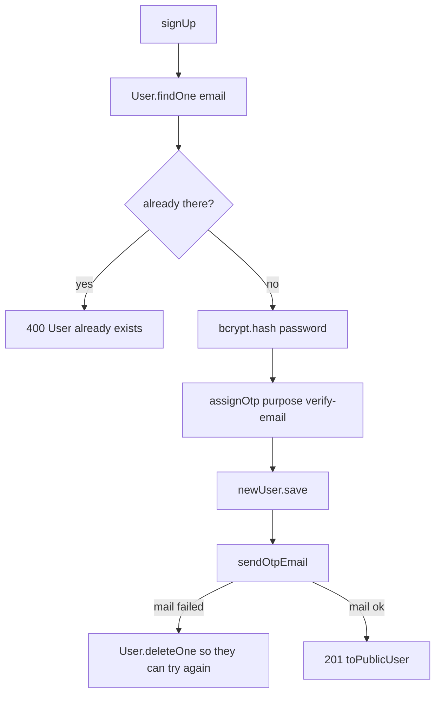
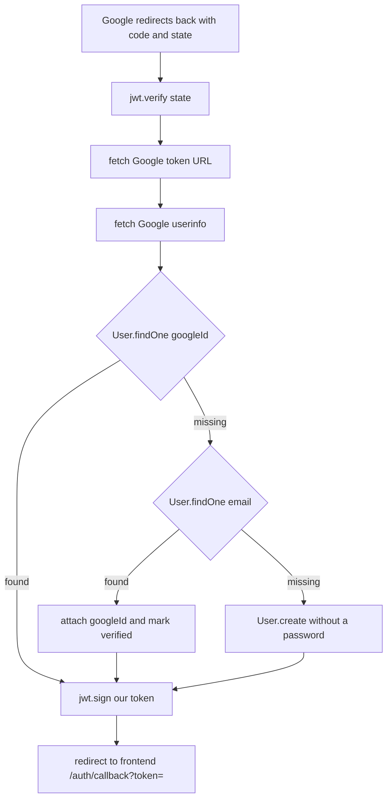

# How the Aether backend works

Read this from top to bottom. The pictures show the order things happen. The words under each picture say what each function is doing.

Think of the backend as a shop with one front door. Customers (the website, or Postman) knock. The shop checks the note, then a worker does the job, then a shelf (the database) is updated.

---

## 1. The whole shop



A request never jumps straight into the database. It always walks this line:

`door -> route -> guard -> worker -> shelf`

---

## 2. What happens when the server starts

File: `backend/index.js`

This file runs first. Nothing else listens for customers until this file finishes.



| Call | What it does |
| --- | --- |
| `require('dotenv').config()` | Reads `.env` so passwords and keys are not written in the code. |
| `express()` | Builds the app object. This is the shop. |
| `cors(...)` | Says the website at `FRONTEND_URL` is allowed to call us. |
| `express.json()` | Turns a JSON body into `req.body`. |
| `morgan('dev')` | Writes a log line like `POST /api/v1/user/login 200`. |
| `connectDB()` | Connects to MongoDB. Defined in `src/configs/db.js`. |
| `app.use('/api/v1/user', userRoutes)` | Any URL starting with `/api/v1/user` goes to the user routes. |
| `app.use('/api/v1/auth', authRoutes)` | Google sign-in lives here. |
| `app.use('/api/v1/categories', categoryRoutes)` | The list of category names. |
| `app.use('/api/v1/products', productRoutes)` | The catalog. |
| `app.use('/api/v1/cart', cartRoutes)` | One cart per logged-in user. |
| `app.listen(PORT)` | Opens the door on port 3000. |

`GET /` only replies `Hello World`. It is a tiny test that the door is open.

---

## 3. One request, step by step

Example: `POST /api/v1/user/signup`



`next()` is the guard saying "you may go to the next person in line." If the guard says no, it sends an error and the worker never runs.

---

## 4. Why the folders exist

```text
backend/
  index.js                 front door
  src/
    configs/               how we plug into MongoDB
    constants/             lists that do not change
    routes/                URL maps
    middlewares/           guards that run before the worker
    validators/            the shape rules for user JSON
    controllers/           the workers
    models/                shelf labels for MongoDB
    helpers/               tools workers share
    templates/emails/      the HTML of the emails
    seeds/                 a script that fills the shop with products
```

### Pros of splitting it this way

- You can point at one folder and say "this only decides URLs" or "this only talks to the database."
- Signup can change without opening the cart file.
- Email HTML lives in templates, not inside a giant controller string.
- Guards (`requireAuth`, `validate`) are reused. Cart, profile, and admin products all use the same login check.

### Cons

- One small feature touches many files. Signup uses a route, a validator, a controller, a model, an OTP helper, and an email helper.
- Beginners get lost jumping between files.
- Some helpers are tiny (`publicUser.js` is one function). That is fine, but it adds another file to open.

A single file would be easier on day one and painful by week three. These folders are the grown-up version of "put toys in labeled boxes."

---

## 5. Folder by folder

### `src/configs`

`db.js` exports `connectDB`.

| Call | What it does |
| --- | --- |
| `mongoose.connect(process.env.MONGODB_URL)` | Opens the database named in `.env`. |
| `console.log` | Says the connection worked. |
| `process.exit(1)` | Stops the server if the database cannot be reached. A shop with no shelves should not stay open. |

### `src/constants`

`categories.js` exports one frozen list:

`phones`, `computers`, `audio`, `gaming`, `accessories`

Products must use one of these words. There is no Category collection. The list is code, so adding a category means editing this file and restarting.

**Pro:** no extra table for five names. **Con:** an admin cannot invent a new category from Postman.

### `src/models`

Models are forms. They say which fields a document may have. They do not decide HTTP.

| Model | Collection | What it stores |
| --- | --- | --- |
| `User` | users | name, email, password or Google id, role, phone, one address, picture URL, verification, hashed OTP |
| `Product` | products | name, description, price, stock, category, picture URL |
| `Cart` | carts | one user, and a list of `{ product, quantity }` |

`price` is a whole number in the smallest money unit. `89999` means `899.99`. We do not store `899.99` as a decimal, because decimals make money bugs.

`password` is required only when there is no `googleId`. Google users do not have a password.

`Cart.user` is unique. One person, one cart.

### `src/middlewares`

Guards. They run before the controller.

`auth.js`

| Function | What it does |
| --- | --- |
| `requireAuth` | Reads `Authorization: Bearer <token>`. `jwt.verify` checks the token was signed with `JWT_SECRET` and is not expired. `User.findById` loads that person. Rejects missing users and unverified users. Puts the user on `req.user`. |
| `requireAdmin` | Runs after `requireAuth`. If `req.user.role` is not `admin`, it sends 403. The role comes from the database, not from the token. |

`validate.js`

| Function | What it does |
| --- | --- |
| `validate(schema, property)` | Runs a Joi schema on `req.body` (or `req.params` if you pass `"params"`). If the body is bad, it sends 400 and stops. If it is good, it replaces `req.body` with the cleaned value (`stripUnknown` throws away extra fields like `role`). Then it calls `next()`. |

### `src/validators`

Each export is a Joi object, not a function that runs by itself. `validate(...)` is what runs them. User, product, and cart routes all use this same style.

**`user.validators.js`**

| Schema | Demands |
| --- | --- |
| `signUpSchema` | first name, last name, email, password |
| `loginSchema` | email, password |
| `verifyOtpSchema` | email and a 6-digit code |
| `resendOtpSchema` | email |
| `forgotPasswordSchema` | email |
| `resetPasswordSchema` | email, code, new password |
| `updateMeSchema` | at least one of name, phone, address. Unknown address keys are rejected. |
| `confirmAvatarSchema` | `publicId` string |

**`product.validators.js`**

| Schema | Demands |
| --- | --- |
| `createProductSchema` | name, description, integer price, integer stock, category from the allowed list |
| `updateProductSchema` | at least one of those fields |
| `listProductsQuerySchema` | optional `page`, `limit` (max 50), `category` |
| `productIdParamSchema` | Mongo id in `params.id` |
| `confirmProductImageSchema` | `publicId` string |

**`cart.validators.js`**

| Schema | Demands |
| --- | --- |
| `addCartItemSchema` | product id and quantity of at least 1 |
| `updateCartItemSchema` | quantity of at least 1 |
| `cartProductIdParamSchema` | Mongo id in `params.productId` |

### `src/helpers`

Shared tools. Controllers call these so the controller stays a story, not a toolbox.

`publicUser.js`

| Function | What it does |
| --- | --- |
| `toPublicUser` | Builds the user JSON we are willing to show. It leaves out `password`, `otpHash`, and the other secret fields. |

`otp.js`

| Function | What it does |
| --- | --- |
| `hashOtp` | Turns the 6-digit code into a SHA-256 hash mixed with `JWT_SECRET`. The database stores the hash, not `482913`. |
| `assignOtp` | Makes a new code, saves the hash, the purpose (`verify-email` or `reset-password`), the expiry (10 minutes), the send time, and resets attempts to 0. Returns the plain code so it can be emailed once. |
| `clearOtp` | Wipes the code fields after a success. |
| `isOtpCoolingDown` | True if a code was sent less than 60 seconds ago. |
| `checkOtp` | Checks purpose, attempt count (max 5), expiry, then compares hashes with `crypto.timingSafeEqual` so a wrong guess does not finish faster when the first digits match. On a wrong guess it adds 1 to `otpAttempts` and returns `failed: true` so the controller will save that count. |

`email.js`

| Function | What it does |
| --- | --- |
| `sendEmail` | `ejs.renderFile` turns a template into HTML. `nodemailer.createTransport` opens SMTP. `sendMail` sends HTML plus a plain-text copy. Port 465 uses `secure: true`. |

`userEmails.js`

| Function | What it does |
| --- | --- |
| `sendOtpEmail` | Calls `sendEmail` with the `otp` template. |
| `sendLoginAlertEmail` | Calls `sendEmail` with the `login-alert` template. |

`cloudinary.js`

The picture file never comes to our server. These functions only hand out a permission slip, then check the locker.

| Function | What it does |
| --- | --- |
| `isConfigured` | True when the three Cloudinary env vars exist. |
| `configure` | Gives the Cloudinary SDK the cloud name, key, and secret. |
| `signUpload` | Signs `{ folder, timestamp }` with the secret. Returns the signature, folder, public api key, and cloud name. The secret stays here. |
| `destroyAsset` | Deletes one photo from Cloudinary. |
| `assertOwnedImage` | Rejects a `publicId` that is not inside the expected folder. Asks Cloudinary if the file exists. Allows only jpg, jpeg, png, webp, and files up to 2MB. Deletes the file if it fails those checks. Returns `{ url, publicId }` when it is good. |

### `src/templates/emails`

EJS files. `header.ejs` and `footer.ejs` are the shared frame. `otp.ejs` and `login-alert.ejs` are the letters. `sendEmail` fills the blanks (`<%= firstName %>`, `<%= otp %>`).

### `src/seeds`

`products.js` is not part of the running server. `npm run seed:products` runs `seedProducts`, which connects, upserts 20 products by name, prints the count, and disconnects. Running it twice does not duplicate those names.

---

## 6. Routes and the workers they call

A route line is a list of functions. Express calls them from left to right.

### User — `src/routes/user.routes.js`

| URL | Line of calls | Worker job |
| --- | --- | --- |
| `POST /signup` | `validate(signUpSchema)` then `signUp` | Create the user and email a verify code. |
| `POST /login` | `validate(loginSchema)` then `login` | Check password, send a login email, return a JWT. |
| `GET /me` | `requireAuth` then `getMe` | Return the logged-in user. |
| `PATCH /me` | `requireAuth`, `validate(updateMeSchema)`, `updateMe` | Change name, phone, or address. |
| `POST /me/avatar/signature` | `requireAuth` then `signAvatar` | Return a Cloudinary signature for `avatars/{userId}`. |
| `POST /me/avatar` | `requireAuth`, `validate(confirmAvatarSchema)`, `confirmAvatar` | Check the uploaded photo, save the URL, delete the old one. |
| `POST /verify-otp` | `validate(verifyOtpSchema)` then `verifyOtp` | Check email + code, mark verified. |
| `POST /resend-otp` | `validate(resendOtpSchema)` then `resendOtp` | Email a new verify code, with a 60-second wait. |
| `POST /forgot-password` | `validate(forgotPasswordSchema)` then `forgotPassword` | Email a reset code to a verified user. |
| `POST /reset-password` | `validate(resetPasswordSchema)` then `resetPassword` | Check the reset code, save a new password hash. |

The full URL adds the prefix from `index.js`. Signup is `POST /api/v1/user/signup`.

### Auth — `src/routes/auth.routes.js`

| URL | Worker | Job |
| --- | --- | --- |
| `GET /api/v1/auth/google` | `googleAuth` | Redirect the browser to Google. |
| `GET /api/v1/auth/google/callback` | `googleCallback` | Trade Google's code for a profile, find or create the user, redirect home with our JWT. |

### Categories — `src/routes/category.routes.js`

| URL | Worker | Job |
| --- | --- | --- |
| `GET /api/v1/categories` | `listCategories` | Return the array from `constants/categories.js`. No database. |

### Products — `src/routes/product.routes.js`

| URL | Line of calls | Worker job |
| --- | --- | --- |
| `GET /` | `validate(listProductsQuerySchema, "query")` then `listProducts` | Public list. Optional `category`, `page`, `limit` (max 50). |
| `GET /:id` | `validate(productIdParamSchema, "params")` then `getProduct` | One product, or 404. |
| `POST /` | `requireAuth`, `requireAdmin`, `validate(createProductSchema)`, `createProduct` | Admin creates a product. |
| `PATCH /:id` | `requireAuth`, `requireAdmin`, param + body validate, `updateProduct` | Admin edits fields. |
| `DELETE /:id` | `requireAuth`, `requireAdmin`, param validate, `deleteProduct` | Admin deletes it and pulls it out of every cart. |
| `POST /:id/image/signature` | `requireAuth`, `requireAdmin`, param validate, `signProductImage` | Signature for folder `products/{productId}`. |
| `POST /:id/image` | `requireAuth`, `requireAdmin`, param + body validate, `confirmProductImage` | Save the checked image URL. |

### Cart — `src/routes/cart.routes.js`

Every cart route starts with `requireAuth`. The cart is found with `req.user._id`, never with a cart id from the URL. You cannot open someone else's cart by guessing an id.

| URL | Worker | Job |
| --- | --- | --- |
| `GET /api/v1/cart` | `getCart` | Return items with the product's current name, price, and stock. |
| `POST /items` | `validate(addCartItemSchema)` then `addItem` | Add a quantity, or add to the quantity already there. Reject if that would pass stock. Does not lower stock. |
| `PATCH /items/:productId` | param + body validate, then `updateItem` | Set the quantity. Still cannot pass stock. |
| `DELETE /items/:productId` | param validate, then `removeItem` | Take that product out of the cart. |

---

## 7. What each controller function calls

### `user.controllers.js`

**`signUp`**



The code is emailed. It is not put in the JSON.

**`login`**

1. `User.findOne({ email })`
2. If there is no password, this account uses Google. Stop.
3. If `isVerified` is false, stop.
4. `bcrypt.compare` checks the password against the hash.
5. `jwt.sign({ id, email })` makes a token that lasts 1 hour.
6. `sendLoginAlertEmail` sends the "someone signed in" letter.
7. Respond with `toPublicUser` and the token.

**`verifyOtp`**

1. `User.findOne({ email })`
2. If there is no user, or they are already verified, say the code is bad. Do not say which.
3. `checkOtp(user, otp, "verify-email")`. A reset code will fail here because the purpose does not match.
4. On a wrong guess, `user.save()` stores the new attempt count.
5. On success, `isVerified = true`, `clearOtp`, `save`.

**`resendOtp`**

1. Find the user by email.
2. If they are missing or already verified, still answer 200 with a vague sentence. That way strangers cannot use this route to learn who has an account.
3. `isOtpCoolingDown` may answer 429.
4. `assignOtp` + `save` + `sendOtpEmail`.

**`forgotPassword`**

Same shape as resend, but the user must already be verified, and the purpose is `reset-password`.

**`resetPassword`**

1. Find by email. Must be verified.
2. `checkOtp(..., "reset-password")`.
3. `bcrypt.hash` the new password, `clearOtp`, `save`.

**`getMe`**

Returns `toPublicUser(req.user)`. `requireAuth` already loaded `req.user`.

**`updateMe`**

Copies only `firstName`, `lastName`, `phone`, and address fields onto `req.user`, then `save`. It never copies `role`, `email`, or `password` from the body. Joi already stripped unknown keys.

**`signAvatar`**

`isConfigured()`, then `signUpload("avatars/" + user id)`.

**`confirmAvatar`**

`assertOwnedImage`. Save `profilePictureUrl` and `profilePicturePublicId`. `destroyAsset` on the previous picture.

### `auth.controllers.js`

**`googleAuth`**

1. Stop if Google env vars are missing.
2. `jwt.sign({ purpose: "google" })` makes a 10-minute `state` note.
3. `res.redirect` sends the browser to Google's consent page with our client id, callback URL, scopes, and that state.

**`googleCallback`**



`fetch` here is Node calling Google. The browser does not see the client secret.

### `category.controllers.js`

**`listCategories`** sends `{ categories: CATEGORIES }`.

### `product.controllers.js`

Helpers used only inside this file:

| Function | What it does |
| --- | --- |
| `toPublicProduct` | The product JSON, with `image` as `{ url, publicId }` or null. |

Input shape is already checked by Joi on the route. Controllers receive cleaned `req.body`, `req.params`, and `req.query`.

**`listProducts`** reads `page`, `limit`, and optional `category` from `req.query`, then `Product.find`, `sort`, `skip`, `limit`, and `countDocuments`.

**`getProduct`** uses `Product.findById(req.params.id)`.

**`createProduct`** uses `Product.create(req.body)`. The client cannot send an image URL here. Joi strips unknown fields.

**`updateProduct`** loads the product, `Object.assign`s `req.body`, `save`.

**`deleteProduct`** runs `Cart.updateMany` with `$pull` so carts lose that product, then `product.deleteOne()`, then `destroyAsset` if a Cloudinary id exists.

**`signProductImage`** and **`confirmProductImage`** are the same two-step photo flow as avatars, with folder `products/{id}`.

### `cart.controllers.js`

Helpers used only inside this file:

| Function | What it does |
| --- | --- |
| `toCartProduct` | The product fields the cart is allowed to show, including the live price. |
| `formatCart` | Turns populated items into JSON. Skips items whose product is missing. |
| `loadCart` | `Cart.findOne({ user }).populate("items.product", ...)` so each item includes the product, not just an id. |

**`getCart`** calls `loadCart` and `formatCart`. No cart yet means an empty list. It does not create a document on read.

**`addItem`**

1. `Product.findById(req.body.productId)`. Missing product is 404.
2. `Cart.findOne` or `new Cart`.
3. If the product is already in the cart, add the quantities. If `nextQuantity > product.stock`, reject.
4. `save`, then `loadCart` again so the response has names and prices.

The client does not send a price. The price is always read from the product.

**`updateItem`** sets quantity to the number in the body. It must be at least 1 and not above stock.

**`removeItem`** filters that product out of `cart.items` and saves.

---

## 8. Three stories to tell in class

### Story A — new student account

1. Browser posts signup JSON.
2. Joi checks the shape.
3. We hash the password and hash a one-time code.
4. We save the user and email the plain code.
5. They post email + code to verify.
6. We compare hashes, set `isVerified`, wipe the code.
7. Login gives them a JWT. Later requests send that token in the header.

### Story B — Google, still on our server

1. Browser opens `/api/v1/auth/google`.
2. We redirect them to Google with a signed `state`.
3. Google sends them back with a `code`.
4. Our server, not the browser, trades the code for their name and email.
5. We find or create a user with `googleId` and no password.
6. We redirect to the website with our JWT.

### Story C — add a phone to the cart

1. `requireAuth` turns the token into `req.user`.
2. `addItem` loads the product.
3. Quantity is checked against stock. Stock does not go down. Orders are not built yet.
4. The cart document stores product id + quantity.
5. The response looks up the product again so the price on screen is today's price.

---

## 9. What is deliberately not here

- No orders and no payments.
- No separate Category collection.
- No guest cart. You must be logged in.
- The first admin is not created by an API. Change `role` to `admin` in the database.
- Resend and forgot-password do not return the code in JSON.
- Profile and cart URLs do not take another user's id.
